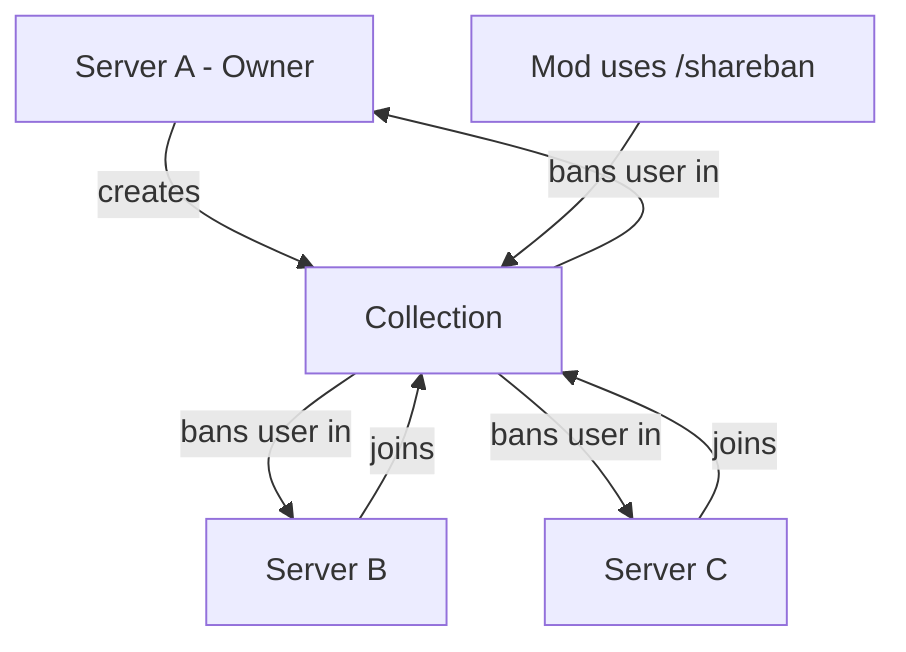
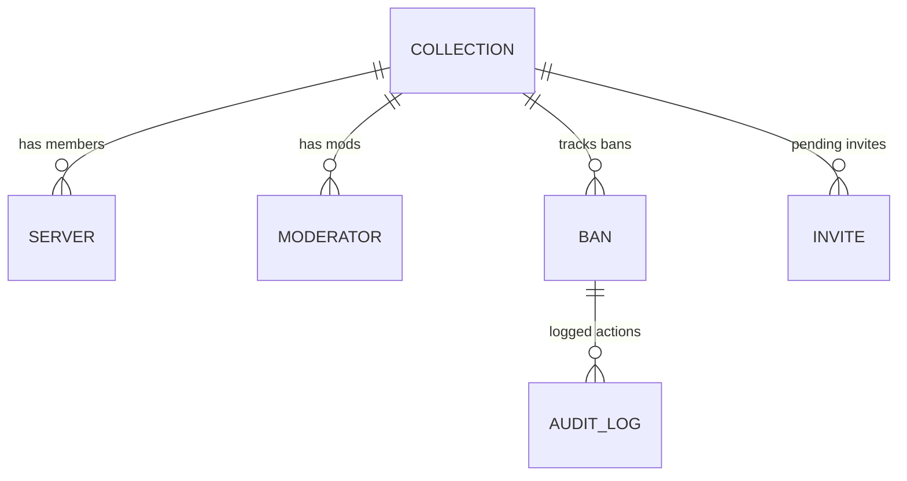

# banshare

a discord bot for sharing bans across multiple servers. servers group into "collections" and when you ban someone, it propagates to all servers in that collection.

built with [sapphire framework](https://www.sapphirejs.dev/) + typescript + sqlite.

## why

if you run multiple discord servers (or partner with other servers), keeping ban lists in sync is annoying. this bot lets you:

- create a collection of servers
- invite other servers to join
- when a mod bans someone, it bans them everywhere
- attach evidence (screenshots, etc) to bans
- lookup ban history across the collection

## setup

### prerequisites

- node 18+
- a discord bot token with these intents:
  - guilds
  - guild members
  - guild bans
  - message content (for evidence uploads)

### install

```bash
git clone <repo>
cd banshare
npm install
```

### configure

create `src/.env`:

```env
DISCORD_TOKEN=your_bot_token_here
```

### run

```bash
# dev
npm run dev

# prod
npm run build
npm run start
```

## commands

| command | what it does |
|---------|--------------|
| `/collection-create` | make a new collection (you become owner) |
| `/collection-invite <server_id>` | invite another server to your collection |
| `/collection-join` | accept a pending invite |
| `/collection-info` | see collection details, members, mods |
| `/collection-edit` | change collection settings |
| `/collection-mods` | add/remove moderators |
| `/collection-delete` | delete your collection |
| `/shareban` | ban a user across all collection servers |
| `/unshareban` | revoke a ban |
| `/lookup-shareban` | search ban history |
| `/view-banshare` | view details of a specific ban |
| `/edit-shareban` | modify an existing ban |

## how it works



### collection structure



## collection settings

collections have a few settings the owner can tweak:

| setting | default | description |
|---------|---------|-------------|
| `dmOnBan` | true | dm users when they get banned |
| `requireEvidence` | false | force mods to attach evidence |
| `allowExpiry` | true | let mods set ban expiration dates |
| `syncExistingBans` | false | when server joins, sync their existing bans |
| `loggingEnabled` | true | post audit logs to `#shareban-logs` channel |
| `banPolicy` | `ban` | what action to take (`ban`, `kick`, `log_only`) |

## moderators

by default only the collection owner can use ban commands. you can add moderators by:

- user id (specific person)
- role id (anyone with that role)

mods can `/shareban`, `/unshareban`, `/lookup-shareban`, etc. but can't change collection settings.

## evidence

when creating a ban, mods can attach:
- images (png, jpg, gif, webp)
- videos (mp4, webm)
- text files
- pdfs

files are stored locally in `./evidence/<ban_id>/`. max 10 files per ban, 25mb each.

## audit logs

if `loggingEnabled` is on, the bot will post to a channel named `#shareban-logs` in each server. if the channel doesn't exist, it'll dm the server owner.

logged actions:
- bans created/revoked
- moderators added/removed
- servers joined/left
- settings changed

## project structure

```
src/
├── commands/          # slash commands
├── database/
│   ├── main.ts        # sqlite connection
│   └── models/        # data models (collection, ban, etc)
├── lib/
│   ├── constants.ts   # paths and stuff
│   ├── setup.ts       # framework config
│   └── utils.ts       # helper functions
└── listeners/         # event handlers
```

## dev notes

- uses better-sqlite3 (synchronous, fast)
- database file is `banshare-db.sqlite` in project root
- evidence dir is `./evidence/`
- sapphire handles command registration automatically

### adding a command

```bash
npm run sapphire generate command
```

or just copy an existing one from `src/commands/`.

## license

unlicense - do whatever you want
